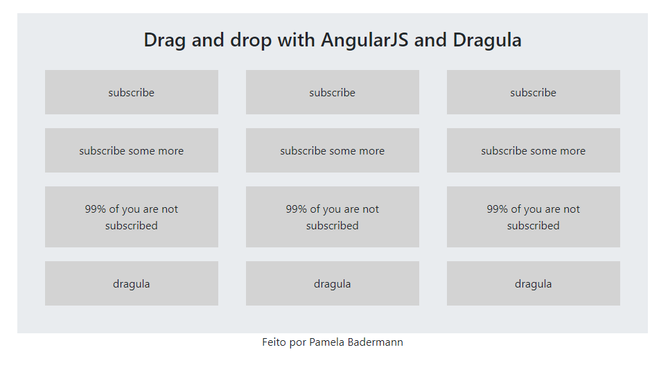

# Drag and Drop with AngularJS and Dragula

## Description

This is a simple implementation of Dragula Drag and Drop, and this project was only designed for studying.
I'm using AngularJS, Bootstrap and Dragula;

